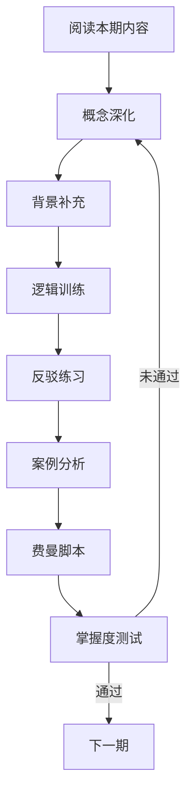

# AI增强学习系统

> 基于认知科学和投资专家认知工具，确保每期内容被完全掌握

---

## 核心设计原则

### 认知科学基础

1. **间隔重复** - 关键概念在不同阶段反复出现
2. **精细加工** - 将新知识与已有知识建立连接
3. **生成效应** - 主动输出比被动接收更有效
4. **元认知监控** - 知道自己知道什么，不知道什么
5. **情境学习** - 在真实场景中应用知识

### 投资专家认知工具

1. **心智模型构建** - 用框架思考，而非碎片知识
2. **对手盘思维** - 永远考虑反方观点
3. **案例归纳** - 从具体案例提取普适规律
4. **压力测试** - 在极端情况下检验认知
5. **费曼复述** - 用简单语言教会他人

---

## AI Prompt系统结构

每期配套以下AI交互模块：

```
📂 AI-Prompts/
├── learning/           # 学习阶段提示词
│   ├── concept-explain/    # 概念解释（多角度）
│   ├── background/         # 专业背景知识补充
│   └── mental-model/       # 心智模型构建
├── training/           # 训练阶段提示词
│   ├── logic-chain/        # 逻辑链条训练
│   ├── counter-argument/   # 反驳练习
│   └── case-analysis/      # 案例分析
├── output/             # 输出阶段提示词
│   ├── feynman-script/     # 费曼讲解脚本生成
│   ├── video-outline/      # 视频大纲生成
│   └── self-check/         # 自检问答
└── mastery-check/      # 掌握度验证
    ├── explain-test/       # 解释能力测试
    ├── apply-test/         # 应用能力测试
    └── connect-test/       # 关联能力测试
```

---

## 使用流程



---

## 掌握标准

| 等级 | 标准 | 验证方式 |
|------|------|----------|
| L1理解 | 能准确复述核心概念 | 概念解释测试 |
| L2应用 | 能在新情境中应用 | 案例分析 |
| L3分析 | 能识别其中的逻辑关系 | 逻辑链条练习 |
| L4评价 | 能评判不同观点的优劣 | 反驳练习 |
| L5创造 | 能用自己的框架重新表达 | 费曼视频输出 |
