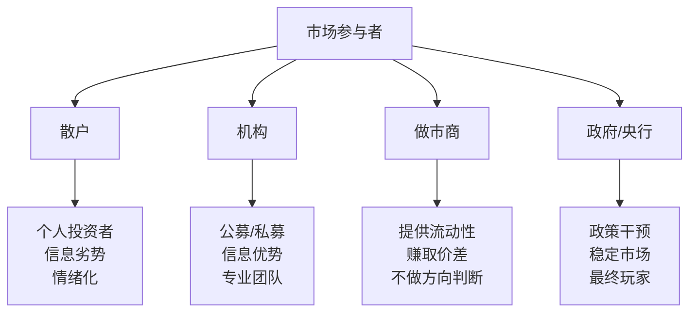

# EP04 - 谁在和你博弈

> 📅 第4期 | 第一季度：认识自我与市场

---

## 📌 本期核心问题

**当你买入一只股票时，是谁卖给你的？他为什么愿意卖？**

---

## 💡 第一性原理拆解

### 交易的本质

> 每一笔交易都有两方：你认为值得买，对方认为值得卖。**至少有一方是错的。**

### 市场参与者分类



### 各玩家的核心特征

| 玩家 | 优势 | 劣势 | 你与他的关系 |
|------|------|------|--------------|
| **散户** | 灵活、无仓位限制 | 信息劣势、情绪化 | 你的难兄难弟 |
| **公募基金** | 专业研究、规模效应 | 排名压力、被迫追涨 | 可能的对手盘 |
| **私募/对冲** | 策略灵活、信息渠道 | 业绩压力、规模限制 | 专业对手 |
| **做市商** | 速度、技术、资金 | 监管、系统风险 | 服务提供者 |
| **央行** | 无限子弹、规则制定 | 政治约束、滞后性 | 游戏规则制定者 |

---

## 🔍 Dalio原则应用

### 原则：了解对手

> "要理解别人在想什么，你需要设身处地地站在他们的角度思考。"

**练习**：每次交易前问自己——
1. 对方可能是谁？
2. 他为什么此时此价卖/买？
3. 他可能知道什么我不知道的？

### 机构的真实思维

```
散户想的：这只股票会涨吗？
机构想的：
    - 这只股票相对于基准会跑赢吗？
    - 我的仓位是否太重需要调整？
    - 年底排名需要我做什么调仓？
    - 赎回压力下我必须卖什么？
```

**洞察**：机构的决策逻辑和散户完全不同。他们不是在预测涨跌，而是在管理组合。

---

## 🧪 案例分析

### 案例1：大宗交易的对手

某日，一只股票出现大宗交易：
- 成交价：折价5%
- 成交量：占总股本2%

**问题**：
- 卖方是谁？（大股东减持？私募退出？）
- 买方是谁？（机构接盘？牛散抄底？）
- 这对你的持仓意味着什么？

### 案例2：涨停板的对手

某股票涨停：
- 封单：10万手
- 你成功买入了

**思考**：
- 谁在涨停价卖给你？
- 他为什么愿意在涨停时卖？
- 他可能知道什么你不知道的？

---

## 🤖 AI辅助学习

### 本期AI对话提示词

```
你是我的投资学习导师。请帮我理解"市场博弈"。

1. 用简单的博弈论语言解释股票交易
2. 机构和散户的信息差具体体现在哪些方面？
3. 作为散户，我在哪些情况下可能有优势？
4. 给我一个分析"对手方"的检查清单
```

---

## ✍️ 费曼作业

### 任务：分析一次交易的对手

回忆你最近的一次交易，完成以下分析：

| 问题 | 你的回答 |
|------|----------|
| 交易时间和价格 | |
| 你买入还是卖出？ | |
| 你当时的逻辑是什么？ | |
| 对方可能是谁？ | |
| 对方可能的逻辑是什么？ | |
| 现在回看，谁对了？ | |

---

## 📊 自检清单

- [ ] 我能说出市场中至少4类参与者吗？
- [ ] 我理解机构和散户的决策逻辑差异吗？
- [ ] 我分析过自己交易的对手方吗？
- [ ] 我知道在什么情况下散户可能有优势吗？

---

## ➡️ 下一期预告

**EP05 - 信息不对称的真相**
