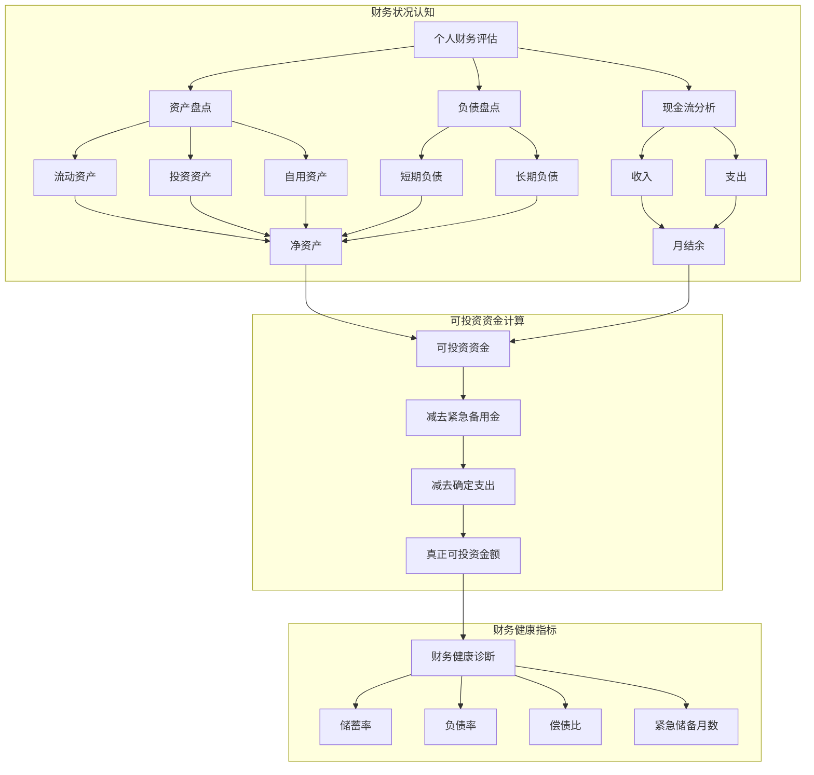

# EP07 - 知识图谱

> 认知自己的财务状况 - 概念关系可视化

---

## 🗺️ 核心概念关系



---

## 📊 概念定义表

| 概念 | 定义 | 健康标准 | 计算公式 |
|------|------|----------|----------|
| **净资产** | 你真正"拥有"的财富 | 正值且稳健增长 | 总资产 - 总负债 |
| **流动资产** | 1年内可变现的资产 | ≥6个月支出 | 现金+活期+货基 |
| **可投资资金** | 扣除必要支出后可用于投资 | 因人而异 | 流动资产 - 备用金 - 确定支出 |
| **储蓄率** | 收入中能存下的比例 | >20% | 月结余 ÷ 月收入 |
| **负债率** | 负债占资产的比例 | <50% | 总负债 ÷ 总资产 |
| **偿债比** | 还债占收入的比例 | <40% | 月还款 ÷ 月收入 |

---

## 🔗 关键逻辑链

### 1. 从"以为有钱"到"真正有钱"

```
银行余额 ≠ 可投资资金

银行余额
    ↓ 减去
6个月紧急备用金
    ↓ 减去
未来1年确定支出（学费、保险、大件）
    ↓ 减去
已承诺支出（婚礼、装修、旅行）
    ↓ 等于
真正可投资的钱
```

### 2. 资产分类逻辑

```
资产
├── 流动资产（可快速变现）
│   ├── 现金
│   ├── 活期存款
│   └── 货币基金
├── 投资资产（为增值持有）
│   ├── 股票/基金
│   ├── 债券
│   └── 投资性房产
└── 自用资产（非投资用途）
    ├── 自住房产
    └── 车辆
```

### 3. 健康诊断决策树

```
开始诊断
    │
    ├── 紧急储备 < 6个月？
    │       ↓ 是
    │   【优先建立紧急储备】
    │
    ├── 负债率 > 50%？
    │       ↓ 是
    │   【优先降低负债】
    │
    ├── 偿债比 > 40%？
    │       ↓ 是
    │   【收入压力过大，暂缓投资】
    │
    └── 全部健康？
            ↓ 是
        【可开始投资规划】
```

---

## 💡 核心洞察

> **投资的第一步不是选股票，而是搞清楚自己有多少筹码可以上桌。**

### 关键记忆点

1. **净资产 vs 现金** - 房子值500万但还欠300万房贷，净资产只有200万
2. **能用 vs 可投资** - 账户有20万但3个月后要交学费10万，可投资只有10万
3. **客观 vs 主观** - 数字健康不等于心理健康，两者都要评估
4. **静态 vs 动态** - 资产负债表是快照，现金流是电影

---

## 🎯 学习路径

```
第一步：资产负债盘点
    ↓
第二步：计算净资产
    ↓
第三步：分析现金流
    ↓
第四步：计算可投资资金
    ↓
第五步：健康诊断
    ↓
第六步：制定改善计划
```

---

## 📚 延伸阅读

| 概念 | 深入学习方向 |
|------|--------------|
| 资产负债表 | 企业财务报表分析基础 |
| 现金流管理 | 富爸爸现金流象限 |
| 紧急备用金 | 个人财务规划标准 |
| 财务健康指标 | CFA个人理财模块 |
