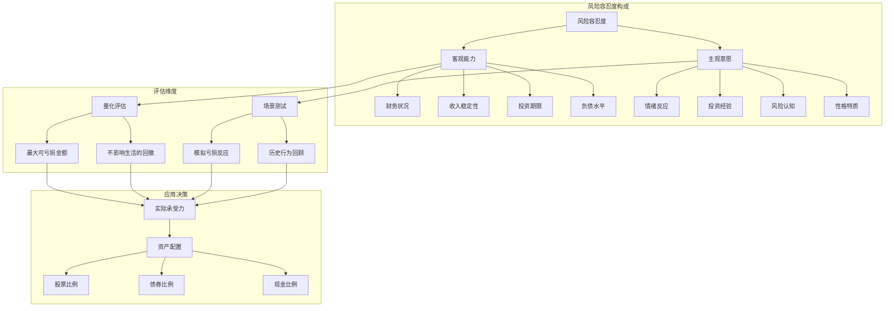
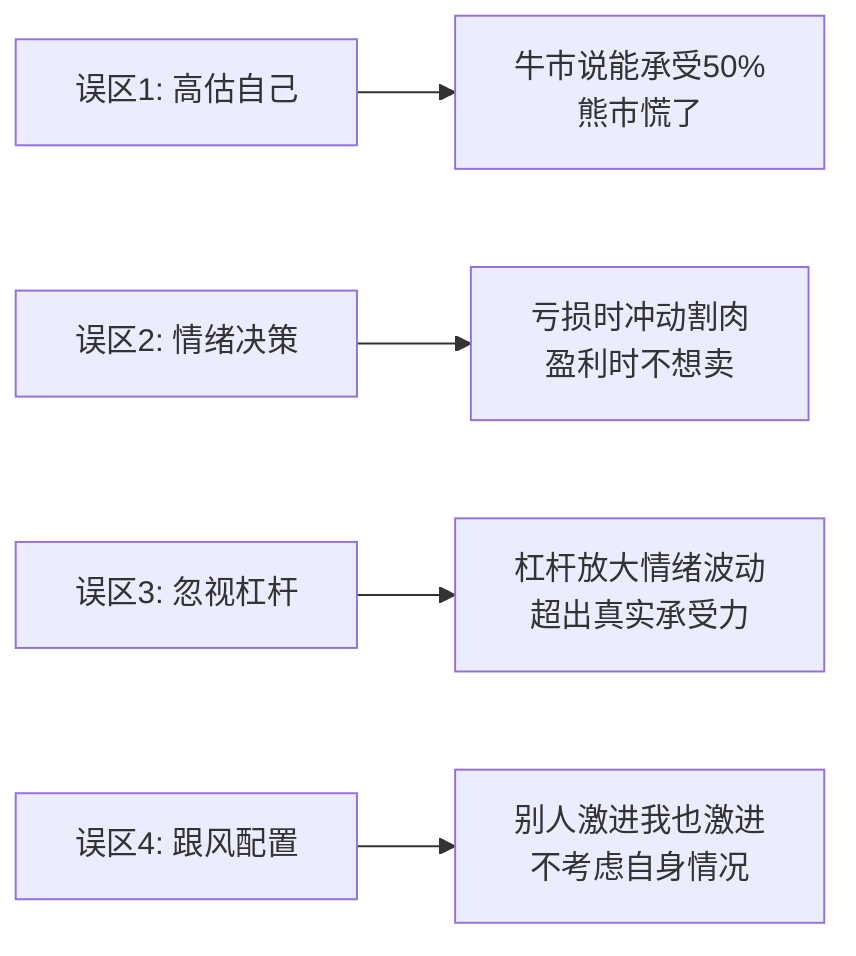

# EP08 - 知识图谱

> 风险容忍度自测 - 概念关系可视化

---

## 🗺️ 核心概念关系



---

## 📊 概念定义表

| 概念 | 定义 | 关键指标 | 决策影响 |
|------|------|----------|----------|
| **客观能力** | 财务上能承受的最大亏损 | 可投资资金×可亏损比例 | 决定投资金额上限 |
| **主观意愿** | 心理上愿意承受的波动 | 开始焦虑的回撤点 | 决定资产配置比例 |
| **实际容忍度** | 两者中的较小值 | min(客观, 主观) | 最终投资决策依据 |
| **风险偏好** | 对风险和收益的取舍倾向 | 保守/稳健/积极/激进 | 参考框架 |

---

## 🔗 关键逻辑链

### 1. 风险承受力的两维度模型

```
风险承受力 = min(客观能力, 主观意愿)

客观能力评估：
├── 净资产多少？
├── 可投资资金多少？
├── 这笔钱多久不用？
└── 亏50%会影响生活吗？

主观意愿评估：
├── 亏10%什么感觉？
├── 亏20%还能睡着吗？
├── 亏30%会割肉吗？
└── 历史上最大亏损时怎么做的？
```

### 2. 风险偏好分类

```
         ┌─────────────────────────────────────┐
         │           风险偏好谱系              │
         └─────────────────────────────────────┘
         
保守型           稳健型           积极型           激进型
  │                │                │                │
  ├─ 股票<30%      ├─ 股票30-50%    ├─ 股票50-70%    ├─ 股票>70%
  ├─ 害怕亏损      ├─ 能接受波动    ├─ 追求增长      ├─ 追求高收益
  ├─ 保本优先      ├─ 平衡收益风险  ├─ 承担较大风险  ├─ 高风险高回报
  └─ 适合：退休/   └─ 适合：中年/   └─ 适合：年轻/   └─ 适合：经验丰富/
     短期需求         中等期限         长期投资         高净值
```

### 3. 从测试结果到资产配置

```
测评得分
    │
    ├── 3-5分：保守型
    │       ↓
    │   股票20% 债券50% 现金30%
    │
    ├── 6-8分：稳健型
    │       ↓
    │   股票40% 债券40% 现金20%
    │
    ├── 9-11分：积极型
    │       ↓
    │   股票60% 债券30% 现金10%
    │
    └── 12分：激进型
            ↓
        股票80% 债券15% 现金5%
```

---

## ⚠️ 常见误区



---

## 💡 核心洞察

> **真正的风险容忍度不是你"说"能承受多少，而是你在真正亏损时"做"了什么。**

### 关键记忆点

1. **测试 vs 现实** - 问卷得分是参考，历史行为是真相
2. **客观 vs 主观** - 财务能力强不代表心理能承受
3. **理想 vs 实际** - 用更保守的数字来规划
4. **静态 vs 动态** - 风险偏好会随年龄和经历改变

---

## 🎯 应用框架

### 风险容忍度自测清单

```
□ 我的可投资资金是多少？
□ 我能接受的最大账面亏损是多少？
□ 如果亏损20%，我还能正常工作生活吗？
□ 我历史上在市场大跌时是怎么做的？
□ 我的投资期限是多长？
□ 我需要用这笔钱的确定时间是什么时候？
```

### 配置调整触发条件

| 触发条件 | 建议行动 |
|----------|----------|
| 开始焦虑、频繁看账户 | 降低股票比例10% |
| 想要"赌一把"翻本 | 暂停交易，冷静审视 |
| 亏损影响睡眠/工作 | 立即降低风险敞口 |
| 完全不关心账户 | 可能可以略微增加风险敞口 |

---

## 📚 延伸阅读

| 概念 | 深入学习方向 |
|------|--------------|
| 行为金融学 | 卡尼曼《思考，快与慢》 |
| 风险管理 | 塔勒布《黑天鹅》 |
| 资产配置 | 马科维茨现代投资组合理论 |
| 情绪管理 | 马克·道格拉斯《交易心理分析》 |
