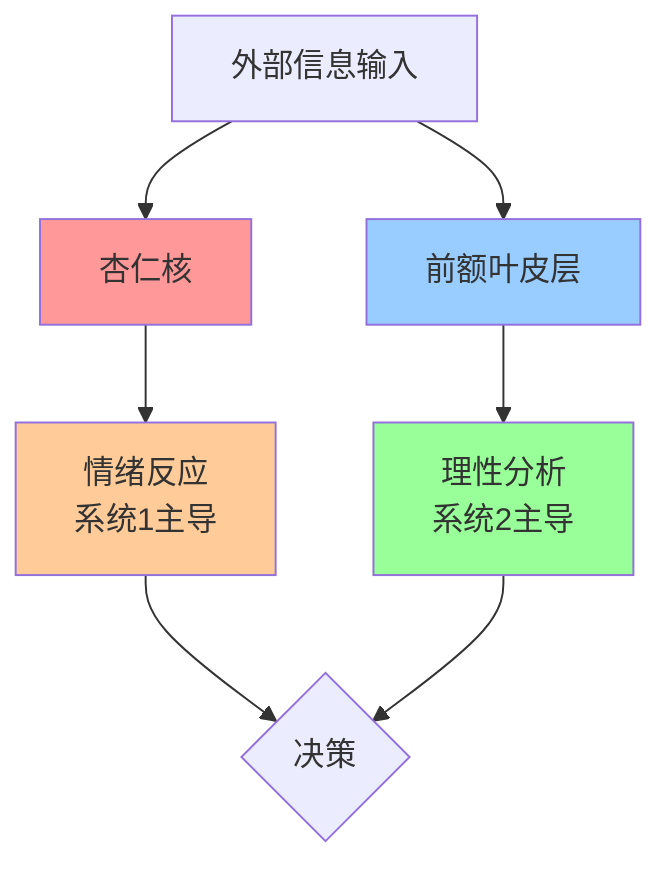
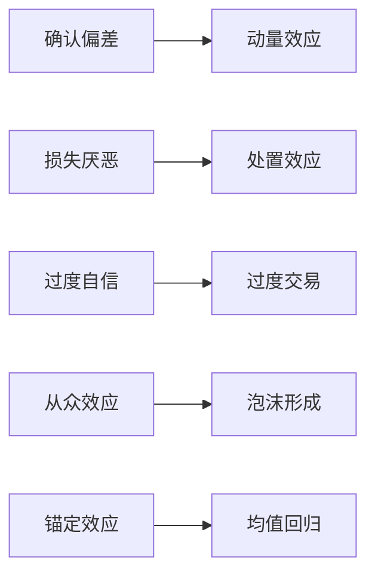
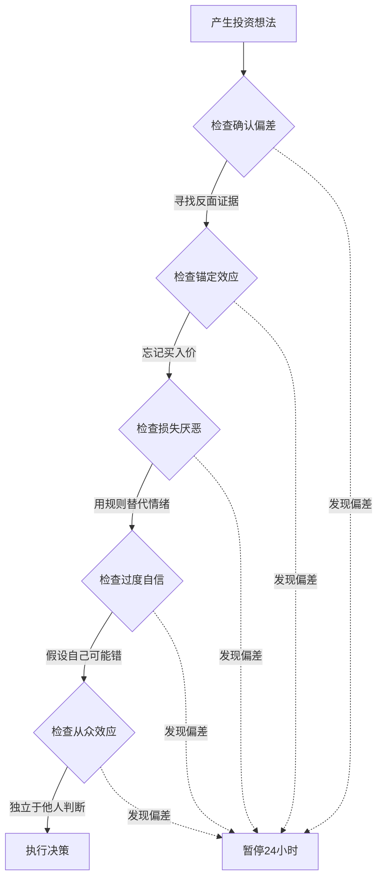

# EP16 - 12个认知偏差：多角度概念理解

> 从不同视角深入理解认知偏差

---

## 🎯 视角一：神经科学视角

### 大脑的两个系统

诺贝尔经济学奖得主丹尼尔·卡尼曼提出了著名的双系统理论：

| 特征 | 系统1（快思考） | 系统2（慢思考） |
|------|----------------|----------------|
| 速度 | 自动、快速 | 需要努力、缓慢 |
| 控制 | 无意识 | 有意识 |
| 能耗 | 低 | 高 |
| 准确性 | 容易出错 | 更准确 |
| 投资应用 | 冲动交易 | 深思熟虑 |

### 认知偏差的神经机制



**关键insight**：
- 杏仁核反应速度（毫秒级）远快于前额叶（秒级）
- 认知偏差多由系统1触发
- 对抗偏差需要激活系统2

---

## 🧬 视角二：进化心理学视角

### 偏差的生存价值

| 偏差 | 远古优势 | 现代劣势 |
|------|----------|----------|
| 损失厌恶 | 避免失去食物和生存资源 | 不愿止损 |
| 从众效应 | 跟随群体逃离危险 | 追涨杀跌 |
| 过度自信 | 敢于行动和竞争 | 过度交易 |
| 可得性偏差 | 快速应对眼前威胁 | 被短期新闻左右 |
| 锚定效应 | 快速判断节省脑力 | 被买入价绑架 |

### 环境错配理论

```
我们的大脑 = 石器时代的硬件 + 21世纪的软件需求

进化给我们的"出厂设置"：
- 响应即时威胁 → 现代需要长期思考
- 资源稀缺心态 → 现代需要理性配置
- 跟随群体生存 → 现代需要逆向思考
```

**关键insight**：认知偏差不是缺陷，是进化的"功能特性"，只是在金融市场这个新环境中失效了。

---

## 📊 视角三：行为金融学视角

### 传统金融学 vs 行为金融学

| 假设对比 | 传统金融学 | 行为金融学 |
|----------|-----------|-----------|
| 投资者特征 | 完全理性 | 有限理性 |
| 信息处理 | 准确无偏 | 存在系统偏差 |
| 决策目标 | 效用最大化 | 满意即可 |
| 市场状态 | 始终有效 | 可能失效 |
| 价格形成 | 反映真实价值 | 受情绪影响 |

### 市场异象与偏差的关联



**市场层面表现**：
- **动量效应**：确认偏差导致投资者追逐趋势
- **处置效应**：过早卖出盈利股票，过久持有亏损股票
- **波动率聚集**：恐惧和贪婪的情绪传染
- **泡沫与崩盘**：从众效应的极端表现

---

## 🎭 视角四：哲学视角

### 认知偏差与自由意志

> "我们以为自己在理性决策，实际上只是在为情绪找理由。"

#### 休谟的论断
> "理性是激情的奴隶"

休谟认为，理性本身没有动力，所有行动都源于情感和欲望。认知偏差正是这一论断的现代验证。

#### 斯宾诺莎的智慧
> "如果没有自我认识，就不可能有理性的行为"

对抗偏差的第一步就是认识到它们的存在——这正是本期课程的目的。

### 苏格拉底悖论

```
"我知道我一无所知" vs "过度自信偏差"

苏格拉底式谦卑：
- 承认自己可能是错的
- 不断质疑自己的信念
- 愿意被证据说服
```

---

## 🧮 视角五：数学与概率视角

### 偏差的量化表现

#### 前景理论的价值函数

```
v(x) = {
    x^α            当 x ≥ 0 时（盈利区间）
    -λ(-x)^β       当 x < 0 时（亏损区间）
}

其中：
α ≈ 0.88（收益递减敏感度）
β ≈ 0.88（损失递减敏感度）
λ ≈ 2.25（损失厌恶系数）
```

**图形特征**：
- 盈利区间：凹函数（边际效用递减）
- 亏损区间：凸函数（边际痛苦递减）
- 亏损曲线比盈利曲线更陡峭

#### 过度自信的数学表达

```
自评能力分布：平均值 = 75分位
实际能力分布：平均值 = 50分位

校准误差 = |自评概率 - 实际准确率|
典型结果：当人们说"90%确定"时，实际准确率约70%
```

### 概率误判：基率忽视

| 场景 | 直觉判断 | 实际概率 |
|------|----------|----------|
| 一支有"利好"的股票 | 80%会涨 | 取决于基率 |
| 市场整体下跌时买入 | 抄底成功 | 历史显示往往贵一段时间 |
| 连续亏损后下一次 | 该盈利了 | 独立事件，概率不变 |

---

## 💡 视角六：实战应用视角

### 偏差识别矩阵

| 你的想法 | 可能的偏差 | 检验方法 |
|----------|-----------|----------|
| "这次不一样" | 确认偏差/过度自信 | 找3个失败的类似案例 |
| "等回本就卖" | 锚定效应/损失厌恶 | 问：如果没持有会买吗？ |
| "大家都在买" | 从众效应 | 问：没人买我还会买吗？ |
| "亏这么多了不能卖" | 沉没成本 | 问：今天会新买入吗？ |
| "我就知道会这样" | 后见之明 | 查自己的书面记录 |
| "刚看了篇分析" | 可得性偏差 | 问：有长期数据支撑吗？ |

### 决策前检查流程



---

## 📚 扩展阅读推荐

### 学术基础
- 《思考，快与慢》丹尼尔·卡尼曼
- 《助推》理查德·塞勒
- 《非理性繁荣》罗伯特·席勒

### 投资应用
- 《行为投资学》詹姆斯·蒙蒂尔
- 《魔鬼投资学》迈克尔·莫布森
- 《你的投资理财一生的财富计划》本杰明·格雷厄姆

---

## 🎯 综合理解测试

### 问题1：系统融合
> 解释为什么"损失厌恶"从进化角度是"正确"的，但在投资中是"有害"的？

### 问题2：跨学科应用
> 如果你是一名基金经理，如何设计一个制度来减少团队的"确认偏差"？

### 问题3：自我反思
> 回顾过去一年，你能识别出自己受哪3个偏差影响最深？请给出具体案例。

```
我的答案：
1. 

2.

3.
```
