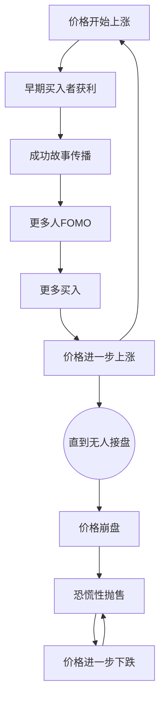

# EP17 - 羊群效应的力量：视频逐字稿

> 📺 时长：约15分钟

---

## 开场（0:00-1:30）

大家好，欢迎来到《通往自由之路》第17期。

今天我们要讨论一个非常有趣的现象：**为什么当别人都在买的时候，你也忍不住想买？当别人都在卖的时候，你也想卖？**

这种现象叫做"羊群效应"。

想象一下这个场景：
- 你走在街上，看到一群人在抬头看天
- 你会怎么做？
- 研究表明，超过80%的人会停下来，也抬头看看

这不是愚蠢，这是我们大脑数十万年进化出来的生存机制。

在远古时代，当其他原始人突然跑起来的时候，不跟着跑的人往往会被猎食者吃掉。所以，我们的大脑被编程为：**在不确定的情况下，跟随群体。**

问题是：**在金融市场上，跟随群体往往意味着灾难。**

今天，我们就来深入理解羊群效应的本质，以及如何对抗它。

---

## 第一部分：羊群效应的科学基础（1:30-5:00）

### 进化心理学解释

让我们从第一性原理来理解羊群效应：

```
远古环境：
信息稀缺 + 危险众多 + 个体脆弱

最优策略：
观察→模仿→生存

数学表达：
P(生存|跟随) > P(生存|独立判断)

结论：
跟随群体是理性的生存策略
```

**具体场景**：
- 别的原始人跑了 → 可能有猛兽 → 跟着跑 = 存活
- 别的原始人在吃某种果实 → 可能是安全的 → 跟着吃 = 不会中毒
- 别的原始人去某个地方 → 可能有资源 → 跟着去 = 获得食物

这些模式深深刻在我们的基因里。

### 神经科学解释

当我们看到其他人做某事时，大脑会发生什么？

**镜像神经元系统**：
- 意大利科学家在1990年代发现
- 当我们观察他人行动时，大脑中执行同样动作的区域也会被激活
- 这解释了为什么我们天生倾向于模仿他人

**多巴胺奖励系统**：
```
看到别人买股票赚钱
    ↓
大脑释放多巴胺
    ↓
产生"我也想要"的冲动
    ↓
模仿行为被强化
```

**恐惧回路**：
```
看到别人卖出股票
    ↓
杏仁核被激活
    ↓
产生"我也要跑"的冲动
    ↓
恐慌性抛售
```

### 社会心理学实验

**所罗门·阿希的从众实验（1951）**：
- 实验者让被试判断线段长度（答案很明显）
- 但安排了7个"托"先给出错误答案
- 结果：75%的被试至少有一次给出错误答案
- 有些人明知道错误，但仍然选择从众

**这告诉我们什么？**
> 即使在答案明显正确的情况下，群体压力也能让人改变判断。

在充满不确定性的金融市场，这种效应只会更强。

---

## 第二部分：羊群效应在金融市场的表现（5:00-9:00）

### 三个阶段模型

羊群效应在市场中通常经历三个阶段：

| 阶段 | 市场状态 | 参与者心理 | 你会怎么感觉 |
|------|----------|-----------|-------------|
| 形成期 | 少数聪明钱开始买入 | 怀疑但好奇 | "这是什么？" |
| 加速期 | 越来越多人加入 | FOMO（错失恐惧） | "不上车就晚了" |
| 崩溃期 | 恐慌性抛售 | 恐惧失控 | "天要塌了" |

### 历史案例分析

**案例1：2020-2021年比特币热潮**

```
2020年3月：比特币5000美元
       ↓ 少数信仰者坚持
2020年10月：比特币10000美元
       ↓ 开始有人注意
2020年12月：比特币30000美元
       ↓ FOMO开始，"不买就错过了"
2021年4月：比特币65000美元
       ↓ 羊群高峰，连不懂的人都在买
2021年6月：比特币30000美元
       ↓ 恐慌抛售
```

**思考题**：如果你在2021年4月买入，你是在跟随聪明钱，还是羊群？

**案例2：1637年荷兰郁金香泡沫**

世界上第一个有记录的金融泡沫：
- 一颗郁金香球茎最高价格 = 阿姆斯特丹一栋房子
- 所有人都在买郁金香
- 然后一夜之间崩盘，价格跌去99%

**案例3：2008年美国房地产泡沫**

- 所有人都相信"房价只会涨"
- 银行拼命发放次级贷款
- 邻居买房了，我也要买
- 最终引发全球金融危机

### 羊群效应的自我强化



这就是反身性理论的实际应用——我们会在第22期详细讨论。

---

## 第三部分：识别羊群效应的信号（9:00-11:00）

### 市场层面信号

| 信号 | 含义 | 危险等级 |
|------|------|---------|
| 交易量暴增 | 大量新人入场 | ⚠️ |
| 媒体高度关注 | 已成大众话题 | ⚠️⚠️ |
| 散户占比上升 | 聪明钱可能在撤 | ⚠️⚠️ |
| 估值严重脱离基本面 | 故事替代了分析 | ⚠️⚠️⚠️ |
| 出租车司机都在讨论 | 最后一批韭菜进场 | 🔴🔴🔴 |

**约翰·肯尼迪的父亲的故事**：
> 传说在1929年大崩盘前，老肯尼迪听到擦鞋童在讨论股票，于是清仓离场。因为当连擦鞋童都开始炒股时，说明所有能入场的人都已经入场了。

### 个人层面信号

如何识别自己是否在"从众"？

**检查清单**：
```
□ 我是因为分析还是因为"别人都在买"而买入？
□ 我能独立说出3个买入理由吗？
□ 如果没有人讨论这个标的，我还会感兴趣吗？
□ 我是否感到FOMO（害怕错过）？
□ 我是否能平静地不行动？

如果有2个以上选"是"的红旗，
很可能你正在被羊群效应影响。
```

### 情绪温度计

| 你的感受 | 可能的陷阱 | 应对策略 |
|----------|-----------|----------|
| "不买就错过了" | 追高进入 | 强制等待24小时 |
| "别人都在赚钱" | 忽视风险 | 问"他们卖出了吗？" |
| "这次不一样" | 泡沫标志 | 找历史案例对比 |
| "不能比别人差" | 社会比较驱动 | 只和过去的自己比 |

---

## 第四部分：对抗羊群效应的策略（11:00-14:00）

### 策略1：建立独立信息源

**问题**：我们的社交媒体形成了信息茧房，让我们只看到与自己观点一致的信息。

**解决方案**：
```
信息来源多元化：
1. 至少关注3个持不同观点的分析师
2. 定期阅读与自己相反的观点
3. 使用AI帮助筛选多元信息
```

### 策略2：建立决策延迟机制

**原理**：羊群效应依赖即时情绪反应，延迟能让理性思考恢复。

**操作方法**：
```
我的24小时规则：
- 任何非计划内的买入决策，必须等待24小时
- 等待期间，写下买入理由
- 24小时后重新评估：还想买吗？
- 如果只是FOMO驱动，情绪会消退
```

### 策略3：预设规则

**原理**：在冷静时制定规则，在冲动时执行规则。

**示例规则**：
```
我的仓位规则：
- 单一标的最大仓位：10%
- 新买入分3次进入，每次间隔1周
- 当市场恐慌指数(VIX)>40时，不减仓
- 当市场亢奋指数非常高时，不加仓
```

### 策略4：逆向思维训练

**巴菲特的智慧**：
> "在别人贪婪时恐惧，在别人恐惧时贪婪。"

**但注意**：这不是简单地做别人的反面，而是保持独立判断。

**训练方法**：
```
每周进行一次逆向思维练习：
1. 选择本周最热门的投资话题
2. 强制自己找出3个反对的理由
3. 评估：反对理由成立吗？
4. 记录你的判断，1个月后验证
```

### 策略5：社交距离

**原理**：减少社交压力，就减少从众冲动。

**操作方法**：
```
投资决策的"社交隔离"：
1. 不在社交场合讨论具体投资标的
2. 不因朋友推荐而买入
3. 保持投资决策私密
4. 找一个理性的投资伙伴定期讨论
```

---

## 结尾（14:00-15:00）

今天我们学习了羊群效应：

**本质**：
- 进化赋予我们的生存机制
- 在确定性低时跟随群体
- 需要主动对抗的本能

**在市场中的表现**：
- 形成期 → 加速期 → 崩溃期
- 自我强化的正反馈循环
- 最终以崩盘收场

**对抗策略**：
1. 建立独立信息源
2. 建立决策延迟机制
3. 预设规则
4. 逆向思维训练
5. 保持社交距离

**费曼作业**：
找一次你因为"别人都在买/卖"而做出的决策，分析当时情境，评估结果，思考如果重来你会怎么做。

**最后的忠告**：
> 当你发现自己在想"不买就来不及了"的时候，那往往正是最该冷静下来的时候。

下一期，我们将讨论**叙事经济学**——故事如何驱动市场。

我们下期见！

---

## 📝 学习笔记空间

```
我最近一次的羊群行为：


当时的情境：


结果如何：


我学到了什么：

```
