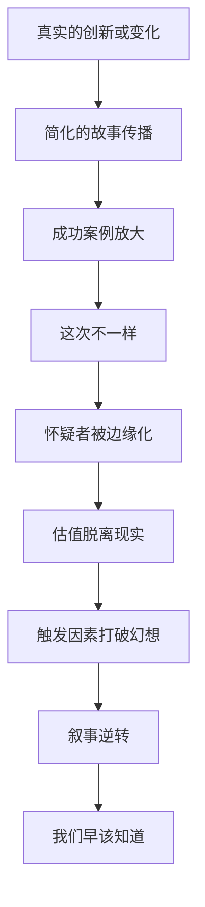

# EP18 - 经典市场叙事案例集

> 从历史叙事中学习模式识别

---

## 🎯 学习目标

通过分析历史上的经典市场叙事，你将学会：
1. 识别叙事的共同模式
2. 理解叙事如何从真实变成泡沫
3. 避免被未来的叙事蒙蔽

---

## 📜 案例一：南海泡沫（1720年）

### 历史背景

南海公司成立于1711年，被授予与南美洲进行贸易的垄断权。

### 叙事分析

**核心叙事**：
> "南美洲遍地黄金，南海公司将带来无穷财富"

**STORY分解**：

| 维度 | 分析 |
|------|------|
| S来源 | 公司高管、政府背书 |
| T真实性 | 贸易权真实，但实际贸易量极小 |
| O乐观度 | 假设西班牙会开放市场（实际没有） |
| R风险 | 复杂的金融操作隐藏了真相 |
| Y你 | 牛顿也亏损了2万英镑 |

**叙事传播**：
```
1720年初：股价100英镑
谣言：南美黄金取之不尽
媒体：大量报道造富故事
社交：每个咖啡馆都在讨论
1720年6月：股价1000英镑（涨10倍）
全民参与：连仆人都在借钱炒股
```

**崩溃**：
```
1720年9月：股价跌回100英镑
大量人破产
议会调查
"南海泡沫"成为历史名词
```

**牛顿的名言**：
> "我能计算天体的运动，但无法计算人类的疯狂。"

### 教训

- 权威背书不等于价值
- 叙事可以完全脱离现实
- 即使最聪明的人也会被叙事蒙蔽

---

## 📜 案例二："咆哮的二十年代"（1920s）

### 历史背景

一战结束后，美国进入繁荣期。新技术（汽车、收音机、电力）改变生活。

### 叙事分析

**核心叙事**：
> "美国进入永久繁荣的新时代"

**叙事元素**：
```
1. 技术叙事：汽车、收音机、电力普及
2. 生活叙事：城市化、消费主义兴起
3. 金融叙事：股票让每个人都能致富
4. 信念叙事："股市是向上的阶梯"
```

**关键人物语录**：

耶鲁大学教授欧文·费雪（1929年10月15日）：
> "股价已经达到了一个永久的高原"

两周后：股市崩盘。

**叙事传播**：
| 信号 | 1928-1929年情况 |
|------|----------------|
| 报纸标题 | "股市创新高" |
| 普通人行为 | 用房子抵押买股票 |
| 专家态度 | "旧规则不再适用" |
| 政策支持 | 利率低，信贷宽松 |

**崩溃**：
- 1929年10月：黑色星期四、黑色星期一
- 3年内股市跌去89%
- 大萧条持续10年

### 教训

- "永久繁荣"是最危险的叙事
- 专家共识可能完全错误
- 杠杆放大叙事的毁灭性

---

## 📜 案例三：互联网革命（1995-2000）

### 历史背景

互联网从学术网络走向大众，改变了信息传播方式。

### 叙事分析

**核心叙事**：
> "互联网将改变一切，传统估值已经过时"

**有趣的是：这个叙事是对的……但时间和方式都错了。**

**叙事层次**：

```
层次1（事实）：互联网改变信息传播
层次2（推论）：所有互联网公司都有价值
层次3（疯狂）：没有盈利也没关系，用户增长就行
层次4（荒谬）：任何名字带.com的都值钱
```

**经典案例**：

| 公司 | 核心叙事 | 结局 |
|------|---------|------|
| Pets.com | 网上卖宠物用品革命 | 9个月破产 |
| Webvan | 在线杂货配送是未来 | 烧光12亿美元 |
| eToys | 网上卖玩具取代商店 | 破产 |
| 亚马逊 | 网上书店走向万物商店 | 成为巨头 |

**同样的叙事，不同的结局**——区别在于执行能力。

**估值疯狂**：
- Pets.com：市值曾超过$10亿，没有盈利
- 市盈率：无穷大（因为没有盈利）
- 新指标：按用户数估值、按点击量估值

### 教训

- 叙事可以是对的，参与者可以是错的
- 趋势长期正确 ≠ 所有公司都成功
- 估值最终还是要回归基本面

---

## 📜 案例四：次贷危机与"房价永远涨"（2003-2008）

### 历史背景

2001年互联网泡沫破裂后，美联储大幅降息，资金涌入房地产。

### 叙事分析

**核心叙事**：
> "房价永远涨，买房是最安全的投资"

**叙事支撑**：
```
论据1：人口增长，房子需求永远在
论据2：土地有限，房价只会涨不会跌
论据3：银行愿意贷款给你，说明他们认为你没风险
论据4：你的邻居都买房赚到了
论据5：政府支持居者有其屋
```

**叙事放大机制**：
- 银行：贷款给任何人（次级贷款）
- 华尔街：把贷款打包成证券卖出
- 评级机构：给垃圾债务3A评级
- 政客：鼓励更多人拥有住房

**危险信号（被忽视）**：
```
□ 无收入、无工作、无资产的人也能贷款
□ 房价收入比创历史新高
□ 投机性购房大量增加
□ "这次不一样"的声音
□ 怀疑者被嘲笑
```

**崩溃**：
- 2006年：房价开始下跌
- 2007年：次贷违约潮开始
- 2008年：雷曼兄弟破产，全球金融危机

### 教训

- "永远"是最危险的词
- 系统性风险往往被低估
- 当所有人都相信同一个故事时，故事崩塌的代价最大

---

## 📜 案例五：加密货币叙事演变（2009-present）

### 叙事演变时间线

**第一阶段（2009-2013）：技术极客叙事**
> "去中心化的数字货币可以对抗通胀"

听众：程序员、密码朋克

**第二阶段（2013-2017）：洗钱/黑市叙事**
> "这是暗网的货币"

听众：边缘群体
结果：Mt.Gox崩盘

**第三阶段（2017-2018）：ICO/致富叙事**
> "每个人都可以发行代币致富"

现象：无数空气币涌现
结果：95%项目归零

**第四阶段（2020-2021）：机构化叙事**
> "数字黄金，对冲通胀，特斯拉都买了"

现象：比特币$69000
特点：机构入场给予合法性

**第五阶段（2022-2023）：怀疑与重建**
> "FTX暴雷，加密货币是骗局吗？"

现象：大量公司倒闭
反思：叙事需要回归基本面

### 分析

**同一事物，不同叙事**：
| 叙事 | 吸引人群 | 估值逻辑 |
|------|---------|---------|
| 无政府货币 | 自由主义者 | 价值=理念 |
| 投机工具 | 短期交易者 | 价值=别人愿意出的价 |
| 数字黄金 | 机构投资者 | 价值=稀缺性+共识 |
| Web3基础 | 技术信仰者 | 价值=未来应用 |

**教训**：
- 同一资产可以承载不同叙事
- 叙事决定了谁会买入
- 叙事的变化影响价格走势

---

## 📊 叙事模式识别总结

### 所有泡沫叙事的共同模式



### 叙事泡沫的共同元素

| 元素 | 表现 |
|------|------|
| 真实内核 | 确实有创新或变化 |
| 过度推广 | 把部分成功推广到全部 |
| 专家背书 | "权威"说旧规则不适用 |
| 社会压力 | 不参与就落后 |
| 自我强化 | 价格上涨"证明"叙事正确 |

### 对你的应用

```
每当遇到新叙事时，问自己：

1. 这个叙事的真实内核是什么？
   （区分事实和推论）

2. 历史上有没有类似的叙事？
   （寻找模式）

3. 什么情况下这个叙事会失败？
   （思考反面）

4. 当前价格反映了多乐观的情景？
   （估值检查）

5. 所有人都相信这个叙事了吗？
   （拥挤度检查）
```

---

## 📝 练习：分析一个当前叙事

选择一个你感兴趣的当前市场叙事，完成分析：

```
叙事名称：

真实内核：

过度推广部分：

与历史案例的相似之处：

潜在失败情景：

当前拥挤度：

我的判断：

```
