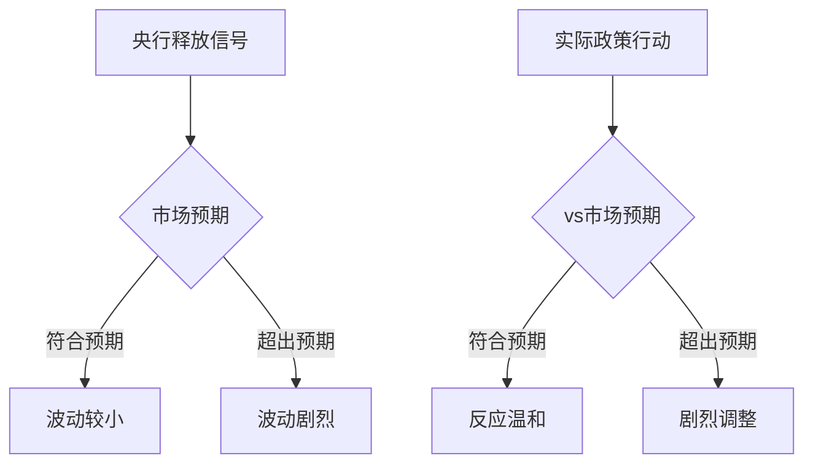

# EP19 - 美联储历史关键时刻案例分析

> 从历史中学习读懂央行信号

---

## 🎯 学习目标

通过分析美联储历史上的关键时刻，你将学会：
1. 理解央行沟通如何影响市场
2. 识别预期管理的模式
3. 避免在关键时刻误判

---

## 📜 案例一：格林斯潘的"非理性繁荣"（1996）

### 背景

1996年12月5日，时任美联储主席艾伦·格林斯潘在美国企业研究所发表演讲。

### 关键讲话

> "我们如何知道何时非理性繁荣（irrational exuberance）过度推高了资产价值？"

### 市场反应

```
格林斯潘讲话：1996年12月5日晚
日本市场：立即下跌3%
欧洲市场：下跌2-4%
美国市场：次日开盘下跌，但随后反弹
```

### 分析

**为什么引发恐慌**：
- 这是美联储主席首次公开质疑股市估值
- 市场担心美联储会因股市过热而加息

**实际结果**：
- 美联储没有因此采取行动
- 股市继续上涨直到2000年互联网泡沫破裂
- "非理性繁荣"成为经典词汇

**教训**：
```
央行可能发出警告，但不一定会行动
警告 ≠ 政策改变
短期市场恐慌后往往回归
```

---

## 📜 案例二：伯南克的"直升机"（2002）

### 背景

2002年11月21日，时任美联储理事本·伯南克发表著名演讲。

### 关键讲话

> "美国政府拥有一种被称为印刷机的技术...可以以本质上为零的成本生产任意数量的美元。"

这句话让他获得了"直升机本"的绰号。

### 含义

伯南克在说明：即使利率降到零，央行仍有工具来刺激经济——可以通过"印钱"来购买资产（后来成为QE）。

### 后续影响

```
2008年金融危机
    ↓
利率降到零仍不够
    ↓
伯南克作为美联储主席启动QE
    ↓
正是他2002年描述的工具
```

**教训**：
```
央行官员的学术观点
可能预示未来的政策工具
关注官员的演讲和论文
```

---

## 📜 案例三：缩减恐慌（2013）

### 背景

2013年5月22日，伯南克在国会作证时暗示可能开始减少QE购债规模。

### 关键讲话

> "如果经济数据持续改善...我们可能在接下来的几次会议上开始减少资产购买的步伐。"

### 市场反应：Taper Tantrum

```
五月至六月：
10年期美债收益率：1.6% → 2.6%（上升100基点）
新兴市场：资本大规模外流
全球股市：剧烈波动
美股：短期下跌后反弹
```

### 分析

**为什么反应如此剧烈**：
- 市场对QE产生了依赖
- 没有预期到美联储会考虑退出
- "买预期，卖事实"的极端版本

**实际情况**：
- 美联储最终在2013年12月才开始缩减
- 缩减过程非常温和
- 但预期管理失败导致了不必要的波动

**教训**：
```
预期管理的失败可以造成巨大市场波动
央行开始讨论政策变化 ≈ 变化迟早会来
市场对货币政策正常化极度敏感
```

---

## 📜 案例四：鲍威尔的"灵活"转向（2019）

### 背景

2018年，鲍威尔坚持加息，导致股市大跌。2019年1月，态度突然转变。

### 措辞变化对比

| 时间 | 措辞 | 市场反应 |
|------|------|---------|
| 2018年10月 | "我们离中性利率还很远" | 标普500跌14% |
| 2018年12月 | "加息路径不是预设的" | 继续下跌 |
| 2019年1月 | "央行将保持耐心和灵活" | 反弹开始 |
| 2019年3月 | "今年加息可能性不大" | 反弹持续 |

### "鲍威尔转向"（Powell Pivot）

```
2018年12月观点：继续加息
    ↓
市场暴跌
    ↓
2019年1月转向：保持耐心
    ↓
市场反弹
    ↓
2019年降息3次
```

### 分析

**关键洞见**：
- 美联储对市场下跌敏感
- "鲍威尔看跌期权"成为市场共识
- 但这也可能导致道德风险

**教训**：
```
美联储可能对市场反馈做出调整
措辞的微妙变化可能预示政策转向
市场有时能"倒逼"央行
```

---

## 📜 案例五："暂时性"通胀误判（2021-2022）

### 背景

2021年，美国通胀开始上升，美联储坚持认为是"暂时性"的。

### 措辞演变时间线

| 时间 | 通胀率 | 美联储措辞 |
|------|--------|-----------|
| 2021年3月 | 2.6% | "通胀上升是暂时性的" |
| 2021年6月 | 5.4% | "暂时性因素主导" |
| 2021年9月 | 5.4% | "持续时间比预期长" |
| 2021年11月 | 6.8% | 删除"暂时性" |
| 2022年3月 | 8.5% | 开始激进加息 |
| 2022年6月 | 9.1% | 承认误判 |

### 鲍威尔的承认

2022年6月：
> "回顾来看，我们应该更早、更快地采取行动。我们现在理解得更好，通胀有多高的不确定性。"

### 市场后果

```
美联储行动落后
    ↓
2022年激进加息（75基点×4次）
    ↓
2022年股市债市双杀
    ↓
史上最差的60/40组合年份之一
```

### 分析

**为什么误判**：
- 疫情造成的供应链问题被认为是暂时的
- 美联储模型可能过时
- 可能也有不想过早收紧的倾向

**教训**：
```
央行可能犯错，而且可能犯大错
当央行主流观点与市场现实脱节时，警惕
不要盲目相信央行的判断
```

---

## 📊 跨案例模式总结

### 共同模式识别



### 规律总结

| 规律 | 说明 |
|------|------|
| 预警≠行动 | 格林斯潘1996年预警，泡沫2000年才破 |
| 学术观点可能成为政策 | 伯南克的"直升机"论成为QE |
| 预期管理失败代价高 | 2013年缩减恐慌 |
| 央行对市场下跌敏感 | 鲍威尔2019年转向 |
| 央行可能犯错 | 2021年"暂时性"误判 |

---

## 📋 实战学习：当前周期应用

### 将历史教训应用于当前

```
当前问题：
美联储会在____年____月降息吗？

历史参考：
1. 措辞变化趋势是什么？
   _________________________________

2. 是否出现类似2019年的"转向"信号？
   _________________________________

3. 市场预期与美联储措辞一致吗？
   _________________________________

4. 是否有类似2021年的"误判"风险？
   _________________________________

我的判断：
_________________________________

验证日期：
_________________________________
```

---

## 💡 关键要点卡片

```
┌────────────────────────────────────────────┐
│                                            │
│     从美联储历史中学到的5个教训            │
│                                            │
│  1️⃣ 预警可能很早，行动可能很晚            │
│     → 不要在警告时恐慌                     │
│                                            │
│  2️⃣ 关注官员的学术观点                    │
│     → 可能预示未来工具                     │
│                                            │
│  3️⃣ 预期管理失败会造成剧烈波动            │
│     → 关注沟通质量                         │
│                                            │
│  4️⃣ 美联储对市场下跌敏感                  │
│     → "美联储看跌期权"可能存在            │
│                                            │
│  5️⃣ 央行可能犯错                          │
│     → 不要盲目相信，保持独立判断          │
│                                            │
└────────────────────────────────────────────┘
```
