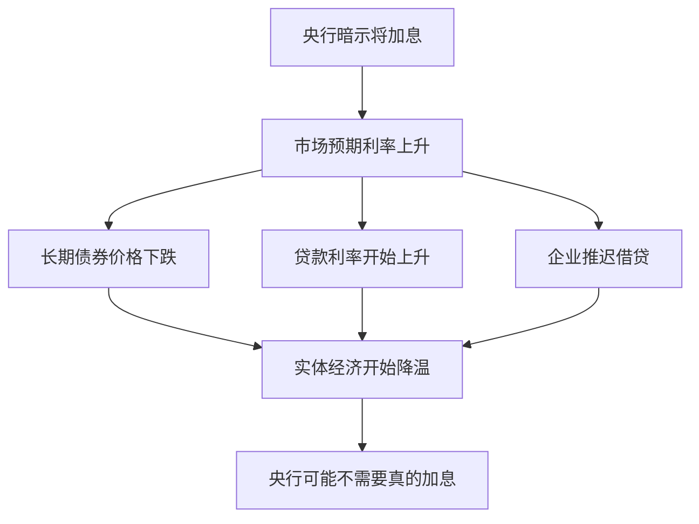

# EP19 - 美联储的心理游戏：视频逐字稿

> 📺 时长：约15分钟

---

## 开场（0:00-1:30）

大家好，欢迎来到《通往自由之路》第19期。

今天我们要讨论一个特别的角色：**美联储（Federal Reserve）**——全球最有影响力的央行。

你有没有发现一个有趣的现象？每次美联储主席讲话，全球市场都会剧烈波动。有时候一个词的变化，就能引发千亿美元的市值波动。

2013年，时任美联储主席伯南克说了一句"我们可能会考虑减少购债规模"，市场就暴跌了——这就是著名的"缩减恐慌"（Taper Tantrum）。

**问题是**：他只是说"可能会考虑"，并没有真的采取行动。为什么市场反应这么大？

答案是：**美联储最强大的工具不是利率，而是预期管理。**

今天，我们就来揭开央行心理游戏的面纱。

---

## 第一部分：央行的真正力量（1:30-5:00）

### 传统理解 vs 真实情况

**传统理解**：
```
央行的工具 = 调整利率
加息 → 借贷成本上升 → 经济降温
降息 → 借贷成本下降 → 刺激经济
```

**真实情况**：
```
央行的工具 = 调整利率 + 管理预期
实际行动只占一部分
预期管理同样重要，甚至更重要
```

### 为什么预期管理有效？

**经济学原理**：

> 当前的资产价格 = 未来现金流的贴现值

关键词是"未来"。如果你能影响人们对未来的预期，你就能影响当前的价格。

**具体机制**：


**关键洞见**：
> 如果市场相信央行会做某事，央行甚至不需要真的做就能达到效果。

### 前瞻性指引的力量

**什么是前瞻性指引（Forward Guidance）**：

央行提前告诉市场未来的政策意图，让市场自己调整。

**历史演变**：
| 时期 | 央行做法 |
|------|---------|
| 旧时代 | 保持神秘，不解释决策 |
| 格林斯潘时代 | 故意说模糊的话 |
| 伯南克后 | 积极使用前瞻指引 |
| 现在 | 沟通成为核心政策工具 |

---

## 第二部分：美联储的语言艺术（5:00-9:00）

### 措辞解码器

美联储声明中的每个词都是经过精心选择的：

| 措辞 | 真实含义 | 市场反应 |
|------|---------|---------|
| "耐心"（patient） | 近期不会行动 | 利好风险资产 |
| "密切关注"（closely monitoring） | 准备好采取行动 | 市场紧张 |
| "适当时候"（at the appropriate time） | 给自己留后门 | 不确定性上升 |
| "数据依赖"（data dependent） | 不想承诺 | 增加波动性 |
| "坚定承诺"（firmly committed） | 不会轻易改变 | 方向明确 |
| "灵活"（flexible） | 可能改变方向 | 注意风险 |

### 案例学习：措辞变化分析

**案例1：从"暂时性"到"我们错了"**

2021年美联储对通胀的描述：
```
2021年初："通胀是暂时性的"（transitory）
2021年中："通胀持续时间比预期长"
2021年末：删除"暂时性"
2022年：承认低估了通胀
```

市场反应：每次措辞变化都引发剧烈波动。

**案例2："考虑加息"的心理游戏**

```
阶段1："目前没有加息计划"
       市场：放心做多

阶段2："可能接近考虑加息的时候"
       市场：开始紧张

阶段3："正在积极讨论加息"
       市场：开始调整仓位

阶段4："准备在即将到来的会议加息"
       市场：加息预期已完全计入

阶段5：实际加息
       市场：反应可能不大（已被消化）
```

### 点阵图：可视化的预期管理

**什么是点阵图（Dot Plot）**：

每个FOMC成员对未来利率的预测以点的形式展示。

**为什么它很重要**：
```
它不是承诺，只是预测
但市场会认真对待
因为这是唯一能看到内部想法的窗口
```

**如何阅读**：
```
                    ●
                ●   ●
            ●   ●   ●
        ●   ●   ●   ●
    ●   ●   ●   ●   ●
────────────────────────
   今年  明年  后年  更远
   
看：中位数、分布范围、趋势变化
```

---

## 第三部分：投资者如何应对（9:00-13:00）

### 策略1：关注措辞变化，而非绝对措辞

**方法**：
```
不要只看这次说了什么
关键是：这次和上次有什么不同

示例对比：
上次："我们将保持耐心"
这次："我们将继续保持耐心，但在必要时会行动"

变化：增加了"在必要时会行动"
含义：态度开始转变
```

### 策略2：区分鹰派和鸽派

**美联储官员分类**：

| 类型 | 特点 | 倾向 |
|------|------|------|
| 鹰派（Hawkish） | 担心通胀 | 倾向加息 |
| 鸽派（Dovish） | 担心就业 | 倾向降息 |
| 中间派 | 两边看 | 随数据调整 |

**应用**：
- 关注谁在发言
- 同样的话从鹰派嘴里说出来意义不同
- 注意投票权重

### 策略3：不要和美联储对抗

**华尔街谚语**：
> "Don't fight the Fed"（不要和美联储对抗）

**含义**：
```
当美联储要放水时：风险资产通常会涨
当美联储要收紧时：风险资产通常会跌

短期可能有偏差
但中期趋势往往和美联储方向一致
```

### 策略4：理解"市场预期"这一变量

**关键框架**：

```
资产价格变动 = 实际结果 - 市场预期

如果市场预期加息50基点，实际加息50基点
→ 价格可能不变（已被消化）

如果市场预期加息50基点，实际加息25基点
→ 价格可能上涨（超预期宽松）
```

**工具**：
- CME FedWatch工具：查看市场定价的加息概率
- 债券市场：10年期国债收益率反映市场预期

### 策略5：建立自己的美联储监控系统

**定期关注**：
```
□ FOMC会议声明（每6周一次）
□ 会议纪要（会后3周发布）
□ 主席新闻发布会
□ 官员公开讲话
□ 点阵图变化（每季度更新）
```

**用AI辅助**：
```
提示词模板：
"请分析这份FOMC声明，与上一份相比：
1. 哪些关键措辞发生了变化？
2. 这些变化意味着什么？
3. 市场可能如何反应？"
```

---

## 第四部分：更大的图景（13:00-14:30）

### 央行的局限性

央行并非全能。它们面临挑战：

1. **可信度悖论**：如果市场不相信央行，预期管理就失效
2. **有效边界**：利率到零后，传统工具失效
3. **政治压力**：独立性受到挑战
4. **不确定性**：没有人能准确预测经济

### 关于预期管理的元思考

> 当你意识到央行在管理预期时，你就开始思考：
> "他们到底相信什么，还是只是想让我相信什么？"

这就是为什么理解央行心理游戏如此重要——你需要区分：
- 央行真正相信的
- 央行想让你相信的
- 市场实际相信的

---

## 结尾（14:30-15:00）

今天我们学习了美联储的心理游戏：

**核心要点**：
1. 央行的力量不仅在于行动，更在于预期管理
2. 每个措辞变化都值得关注
3. "不要和美联储对抗"是实用智慧
4. 理解市场预期是理解价格反应的关键

**实用策略**：
- 关注措辞变化
- 区分鹰派/鸽派
- 跟踪市场预期
- 建立监控系统

**费曼作业**：
找一份最近的FOMC声明，对照上一份，找出措辞变化，分析其含义。

下一期，我们将学习**庄家思维入门**——如果你是主力，你会怎么做。

我们下期见！

---

## 📝 学习笔记空间

```
我找到的FOMC声明日期：


与上一份对比的措辞变化：
1. 

2. 

3. 

这些变化的含义：


市场的实际反应：


我的判断是否正确：

```
