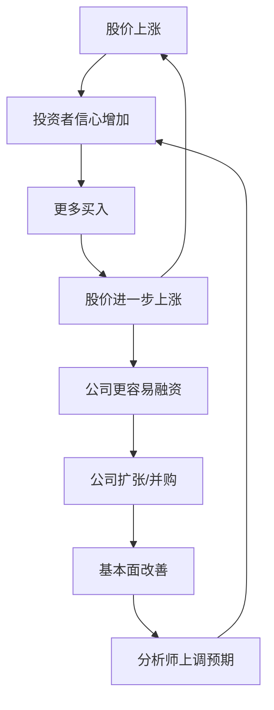

# EP22 - 反身性理论：视频逐字稿

> 📺 时长：约15分钟

---

## 开场（0:00-1:30）

大家好，欢迎来到《通往自由之路》第22期。

今天我们要学习一个非常深刻的概念：**反身性理论**——这是传奇投资者乔治·索罗斯的核心思想。

索罗斯是谁？他是历史上最成功的对冲基金经理之一，1992年做空英镑的"击溃英格兰银行"一役让他一战成名。

但索罗斯不仅是交易者，他还是一个哲学家。他的反身性理论挑战了传统经济学的基本假设。

**核心问题**：
> 传统经济学认为，价格由基本面决定，预期只是反映现实。
> 索罗斯说，不对。预期不仅反映现实，还会**改变**现实。

这个看似简单的洞见，将彻底改变你对市场运作的理解。

---

## 第一部分：反身性的核心概念（1:30-5:00）

### 传统思维 vs 反身性思维

**传统金融学的因果链**：
```
基本面（事实）→ 投资者预期 → 市场价格

例如：
公司盈利上升 → 投资者看好 → 股价上涨
```

这是单向的因果关系。

**反身性的因果环**：
```
基本面 ⟷ 投资者预期 ⟷ 市场价格
       ↺ 相互影响循环 ↻

例如：
股价上涨 → 公司更容易融资 → 基本面改善 → 进一步上涨
```

这是双向的、循环的影响。

### 索罗斯的两个函数

索罗斯用两个函数来描述反身性：

**1. 认知函数（Cognitive Function）**
> 参与者的理解反映情境

```
y = f(x)
预期 = 基于现实的分析
```

**2. 参与函数（Participating Function）**
> 参与者的行动影响情境

```
x = g(y)
现实 = 被预期所改变
```

**关键洞见**：
> 因为x依赖于y，y又依赖于x，两者形成了反馈循环。

### 银行挤兑：反身性的经典案例

```
正常状态：
银行健康 → 储户放心 → 不取钱 → 银行确实健康

反身性逆转：
谣言"银行要倒" → 储户恐慌 → 挤兑取钱 → 银行真的倒了

预言自我实现！
```

即使银行本来是健康的，但如果足够多的人相信它要倒，它就真的会倒。

**这就是反身性的力量**：预期改变了现实。

---

## 第二部分：反身性的市场应用（5:00-9:00）

### 正反馈循环（泡沫形成）



**具体案例：科技股泡沫**
```
股价上涨 →
公司能融到更多钱 →
用股票做货币收购其他公司 →
规模扩大，"故事"更好讲 →
分析师上调目标价 →
更多投资者买入 →
股价进一步上涨 →
...循环加速...
直到脱离任何合理估值
```

### 负反馈循环（崩盘形成）

```
股价下跌 →
公司信用评级下降 →
融资成本上升/融资困难 →
不得不缩减业务 →
基本面恶化 →
分析师下调预期 →
更多投资者卖出 →
股价进一步下跌 →
...恶性循环...
```

**2008年金融危机中的反身性**：
```
房价开始下跌 →
持有房贷的MBS价值下降 →
银行资产负债表恶化 →
银行惜贷，信贷紧缩 →
经济活动减少 →
房价进一步下跌 →
...恶性循环...
```

### 反身性的三个阶段

| 阶段 | 特征 | 投资策略 |
|------|------|---------|
| 初期 | 趋势与基本面一致 | 顺势而为 |
| 加速期 | 趋势脱离基本面，自我强化 | 参与但警惕 |
| 反转期 | 偏离极端，反向力量积累 | 准备逆向 |

**识别阶段的关键**：
> 看预期和现实的差距。差距越大，反转越近。

---

## 第三部分：索罗斯如何用反身性赚钱（9:00-12:00）

### 1992年击溃英格兰银行

**背景**：
- 英镑加入欧洲汇率机制（ERM），承诺维持固定汇率
- 英国经济疲软，利率高企Causing recession
- 德国因统一需要高利率，英国骑虎难下

**索罗斯的反身性分析**：
```
当前状态：
英格兰银行承诺维持汇率 →
市场暂时相信 →
英镑维持稳定

索罗斯看到的：
英国经济需要低利率 ≠ ERM要求的高利率
这个矛盾不可持续

反身性推演：
如果市场开始怀疑 →
投机者做空英镑 →
英格兰银行被迫动用外汇储备捍卫 →
储备有限，怀疑加剧 →
更多做空 →
英格兰银行要么大幅加息（更伤经济）要么放弃 →
最终只能放弃
```

**结果**：
- 索罗斯借入100亿美元做空英镑
- 1992年9月16日"黑色星期三"，英国退出ERM
- 索罗斯一天赚10亿美元

### 反身性交易策略的本质

**核心逻辑**：
```
1. 识别当前被忽视的不平衡
2. 预见反身性将如何放大这个不平衡
3. 在大多数人意识到之前建仓
4. 耐心等待反身性循环展开
5. 在循环加速时加仓
6. 在反转迹象出现时离场
```

**关键能力**：
- 识别主流认知与现实的偏差
- 理解反身性如何放大偏差
- 承受"过早正确"的痛苦
- 知道何时离场

---

## 第四部分：如何用反身性保护自己（12:00-14:30）

### 识别你正处于哪个反身性阶段

**检查清单**：

```
【正反馈加速期警告信号】
□ 股价涨幅远超基本面改善
□ 估值指标创历史新高
□ 乐观叙事主导，质疑者被边缘化
□ 公司用高估值股票大量并购
□ "这次不一样"的声音响亮

勾选3项以上 = 正反馈可能过度
```

```
【反转信号】
□ 核心假设开始被质疑
□ 边际买家减少
□ 叙事出现裂缝
□ 内部人开始卖出
□ 聪明钱流出

勾选3项以上 = 可能接近反转
```

### 反身性思维原则

**原则1：预期可以成为现实**
```
相信 → 行动 → 改变现实 → 预言成真

启示：注意市场共识的力量
```

**原则2：过度终将修正**
```
反身性放大的偏差不可持续
越是脱离基本面，修正越剧烈

启示：极端估值终会回归
```

**原则3：你可能是反身性循环的燃料**
```
如果你是跟风买入的人
你的买入帮助推高了价格
你是正反馈的一部分

启示：问自己是推动循环还是被循环推动
```

### 实用策略

**1. 在正反馈早期顺势**
```
当基本面支持趋势时
反身性会加速趋势
可以参与，但设止损
```

**2. 在正反馈末期警惕**
```
当价格远远偏离基本面时
这是危险区域
减仓或离场
```

**3. 在负反馈末期准备**
```
当恐慌达到极点时
可能是机会
但等待确认
```

---

## 结尾（14:30-15:00）

今天我们学习了索罗斯的反身性理论：

**核心概念**：
- 传统：现实 → 预期 → 价格（单向）
- 反身性：现实 ⟷ 预期 ⟷ 价格（双向循环）

**市场表现**：
- 正反馈循环创造泡沫
- 负反馈循环造成崩盘
- 三个阶段：初期、加速期、反转期

**投资启示**：
1. 预期可以改变现实
2. 过度的反身性终将修正
3. 识别你在循环中的位置

**费曼作业**：
找一个反身性正反馈的实例，分析预期如何改变了现实，循环如何自我强化。

下一期，我们将学习**市场周期的心理阶段**——从怀疑到贪婪到恐惧的情绪周期。

我们下期见！

---

## 📝 学习笔记空间

```
我找到的反身性案例：


预期如何影响了现实：


正反馈如何自我强化：


目前处于什么阶段：

```
