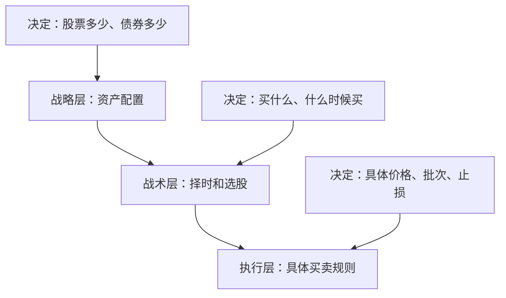

# EP27 - 什么是投资系统：视频逐字稿

> 📺 时长：约15分钟

---

## 开场（0:00-1:30）

大家好，欢迎来到《通往自由之路》第27期。

从今天开始，我们进入第三季度的学习：**建立系统与策略**。

前两个季度，我们认识了自己，理解了人性和市场。现在是时候把这些知识转化为**可执行的投资系统**了。

今天的核心问题：**什么是投资系统？为什么规则比直觉更重要？**

想象两个投资者：
- 投资者A：每次买卖都"跟着感觉走"
- 投资者B：有一套明确的规则，按规则执行

3年后，谁更可能成功？

答案是：**投资者B**。不是因为他的规则一定完美，而是因为他可以通过系统不断改进。

---

## 第一部分：系统思维的本质（1:30-5:00）

### 什么是投资系统

**定义**：
> 投资系统是一套可重复、可验证、可改进的决策规则集合。

**关键特征**：

| 特征 | 含义 |
|------|------|
| 可重复 | 同样情况下做同样决策 |
| 可验证 | 可以回测和追踪效果 |
| 可改进 | 根据结果迭代优化 |
| 规则化 | 减少情绪干扰 |

### 系统 vs 随机决策

```
随机决策：
情绪好 → 买入
听到消息 → 买入
感觉要涨 → 买入
结果：无法知道什么有效，什么无效

系统决策：
满足条件A+B+C → 买入
不满足条件 → 不买
结果：可以评估条件是否有效，持续改进
```

### 达利欧的原则化思维

瑞·达利欧在《原则》中写道：

> "我发现，我能够把大多数事情变成原则，然后按原则行事，而不是每次都重新思考。"

**原则化思维的好处**：
1. **减少决策疲劳**：不用每次都重新思考
2. **避免情绪干扰**：规则在冷静时制定
3. **可以传承和分享**：不依赖个人直觉
4. **持续优化**：规则可以被验证和改进

---

## 第二部分：投资系统的五要素（5:00-10:00）

### 要素一：入场规则

**核心问题**：什么条件下买入？

```
好的入场规则示例：
"当满足以下全部条件时买入：
1. 估值低于历史均值
2. 基本面符合我的筛选标准
3. 市场情绪不在狂热阶段"

差的入场规则：
"感觉要涨了"
"别人都在买"
```

### 要素二：仓位规则

**核心问题**：买多少？

```
仓位规则示例：
"单只股票仓位不超过10%"
"新买入分3批进入"
"高确信度交易可加码至15%"
```

**为什么重要**：
> 买对了但仓位太小 = 赚不多
> 买错了但仓位太大 = 亏很多

### 要素三：出场规则

**核心问题**：什么条件下卖出？

```
出场规则类型：
1. 止损型："下跌15%必须卖出"
2. 止盈型："达到目标收益考虑卖出"
3. 时间型："持有2年后重新评估"
4. 条件型："买入逻辑不再成立时卖出"
```

### 要素四：风险管理

**核心问题**：如何限制损失？

```
风险管理规则示例：
"总仓位亏损达10%时，暂停交易"
"单月最大亏损5%"
"极端行情时减仓至50%以下"
```

### 要素五：记录复盘

**核心问题**：如何评估和改进？

```
记录项目：
- 每次交易的买卖理由
- 交易时的情绪状态
- 结果和偏离分析
- 月度/季度系统评估

复盘问题：
- 哪些规则有效？
- 哪些规则失效？
- 需要添加什么规则？
- 需要修改什么规则？
```

---

## 第三部分：系统的层级（10:00-12:30）

### 三层系统架构



**层级说明**：

| 层级 | 时间框架 | 决策频率 | 重要性 |
|------|---------|---------|--------|
| 战略层 | 年 | 低 | 最高 |
| 战术层 | 月/季 | 中 | 高 |
| 执行层 | 日/周 | 高 | 中 |

### 常见误区

**误区1：过度关注执行层**
```
很多人花大量时间研究：
"今天该不该买？"
"这个价格好不好？"

但忽略了更重要的：
"我的整体配置合理吗？"
"我选股的逻辑对吗？"
```

**误区2：规则太多或太少**
```
规则太少：
- 无法指导实际操作
- 留太多给情绪决策

规则太多：
- 执行困难
- 规则互相冲突
- 难以坚持
```

**平衡点**：
> 规则多到能覆盖主要情况，少到能记住和执行。

---

## 第四部分：开始构建你的系统（12:30-14:30）

### 从简单开始

**第一版系统不需要完美**

```
初版系统示例：

入场：
- 只买入我理解的公司
- 估值低于行业均值

仓位：
- 单只不超过20%
- 保持20%现金

出场：
- 亏损20%止损
- 达到100%收益考虑卖出

风险：
- 总资产回撤10%时暂停

记录：
- 每次交易写理由
- 每月回顾一次
```

### 系统进化路径

```
1.0版：简单规则，能执行
    ↓ 实践检验
2.0版：修正明显问题
    ↓ 更多实践
3.0版：添加细节和例外处理
    ↓ 持续迭代
N.0版：适合你的成熟系统
```

### 重要提醒

**1. 系统是个人化的**
- 没有"最好"的系统
- 只有"适合你"的系统
- 风险偏好、时间精力、知识背景都不同

**2. 执行力是关键**
- 最好的规则不执行=没有规则
- 简单但坚持 > 复杂但放弃

**3. 允许修改，但要有仪式**
- 不在交易时修改规则
- 在冷静时、有数据支持时修改
- 每次修改都记录原因

---

## 结尾（14:30-15:00）

今天我们学习了投资系统的基本概念：

**核心认知**：
- 规则 > 直觉
- 可重复、可验证、可改进

**五个要素**：
1. 入场规则
2. 仓位规则
3. 出场规则
4. 风险管理
5. 记录复盘

**下一步**：
在接下来几期，我们会详细学习每个要素的设计方法。

**费曼作业**：
用自己的话写出投资系统的5个要素，评估自己目前每个要素的完成度。

下一期，我们将学习**资产配置的数学原理**——为什么资产配置是"唯一的免费午餐"。

我们下期见！

---

## 📝 学习笔记空间

```
我的投资系统五要素自评：

入场规则：□有 □没有 □模糊
仓位规则：□有 □没有 □模糊
出场规则：□有 □没有 □模糊
风险管理：□有 □没有 □模糊
记录复盘：□有 □没有 □模糊

最需要建立的是：

```
