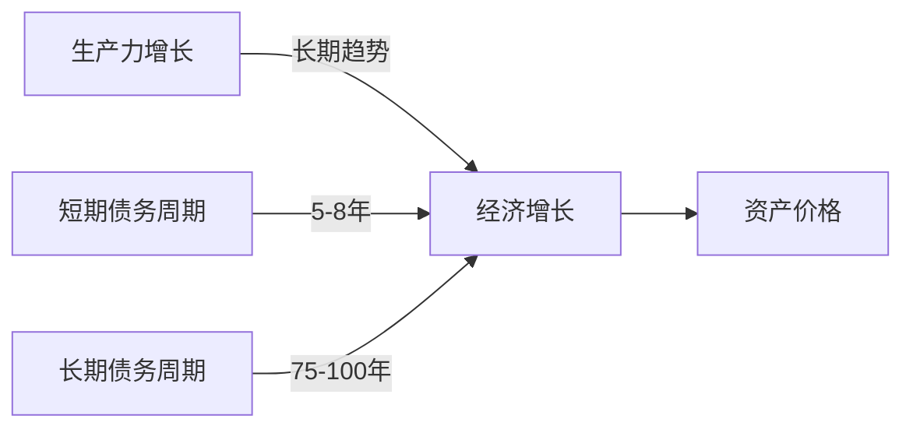

# EP03 - 市场是一台什么机器

> 📅 第3期 | 第一季度：认识自我与市场

---

## 📌 本期核心问题

**市场看起来混乱无序，但它有底层运转逻辑吗？**

---

## 💡 第一性原理拆解

### Dalio的经济机器模型

> "经济就像一台简单的机器。"



### 三大驱动力

| 驱动力 | 周期 | 特点 | 投资影响 |
|--------|------|------|----------|
| 生产力增长 | 长期稳定（2-3%/年） | 技术进步、效率提升 | 长期投资的锚 |
| 短期债务周期 | 5-8年 | 信用扩张→紧缩 | 择时的参考 |
| 长期债务周期 | 75-100年 | 大萧条、债务危机 | 代际风险 |

### 最简化的市场公式

```
资产价格 = 货币量 ÷ 资产量
```

**洞察**：
- 央行印钱 → 货币量↑ → 资产价格↑
- 但实际财富没变 → 只是货币贬值
- 这就是为什么"通胀是隐形税"

---

## 🔍 Dalio原则应用

### 原则：理解因果关系

> "任何事情的发生都有原因。找到原因，你就能预测未来类似情况。"

**应用到市场**：
- 股市涨跌不是随机的
- 背后有货币、信用、情绪的驱动
- 理解驱动力 > 预测具体点位

### 信用周期的四个阶段

```
┌─────────────────────────────────────────────────────────────┐
│  1.扩张期                                                    │
│  信用扩张 → 资产价格上涨 → 乐观情绪 → 更多借贷                 │
├─────────────────────────────────────────────────────────────┤
│  2.顶部                                                      │
│  杠杆过高 → 估值泡沫 → "这次不一样"心态                       │
├─────────────────────────────────────────────────────────────┤
│  3.收缩期                                                    │
│  信用紧缩 → 资产价格下跌 → 恐慌 → 去杠杆                      │
├─────────────────────────────────────────────────────────────┤
│  4.底部                                                      │
│  低估值 → 悲观情绪 → 政策刺激 → 新的扩张开始                   │
└─────────────────────────────────────────────────────────────┘
```

---

## 🧪 案例分析

### 案例1：2008年金融危机

**按机器模型解读**：
1. （扩张）2003-2007：低利率→房贷扩张→房价上涨→更多杠杆
2. （顶部）2007："房价永远涨"成为共识
3. （收缩）2008：次贷违约→银行危机→信用冻结→资产暴跌
4. （干预）美联储QE→注入流动性→市场触底

**洞察**：危机不是意外，而是周期的必然阶段

### 案例2：2020年疫情冲击

```
冲击：疫情导致经济停摆
     ↓
反应：美联储印钱2万亿美元
     ↓
结果：资产价格V型反弹
     ↓
后果：2022年通胀→加息→资产回调
```

**洞察**：货币量↑ 最终导致资产价格↑，但有滞后

---

## 🤖 AI辅助学习

### 本期AI对话提示词

```
你是我的投资学习导师。请帮我理解Dalio的"经济机器"模型。

1. 用最简单的语言解释"债务周期"
2. 现在（2026年）我们处于周期的什么阶段？给出你的分析
3. 普通投资者如何根据周期阶段调整策略？
4. 这个模型的局限性是什么？
```

### 深度探索提示词

```
我理解了经济机器的基本概念。

请帮我深入探索：
1. 中国的债务周期和美国有什么不同？
2. 日本"失落的三十年"用这个模型怎么解释？
3. 数字货币会改变这个机器的运转方式吗？
4. 如果机器是可预测的，为什么还是有人亏钱？
```

---

## ✍️ 费曼作业

### 任务1：画出市场机器

用一张图画出市场运转的核心循环，要求包含：
- 货币/信用
- 资产价格
- 参与者情绪
- 政策干预

### 任务2：周期定位

根据你的理解，判断：
- 当前A股处于什么周期阶段？
- 当前美股处于什么周期阶段？
- 说明你判断的依据

### 任务3：观看视频

观看Dalio的"经济机器如何运转"视频（YouTube/B站），写200字观后感。

---

## 📊 自检清单

- [ ] 我能用简单语言解释"债务周期"吗？
- [ ] 我理解央行印钱对资产价格的影响吗？
- [ ] 我知道如何判断当前处于周期的哪个阶段吗？
- [ ] 我完成了市场机器图吗？
- [ ] 我明白为什么"理解机器"比"预测价格"更重要吗？

---

## ➡️ 下一期预告

**EP04 - 谁在和你博弈**

分析市场中的各类参与者：散户、机构、做市商、央行，理解你的对手盘。
